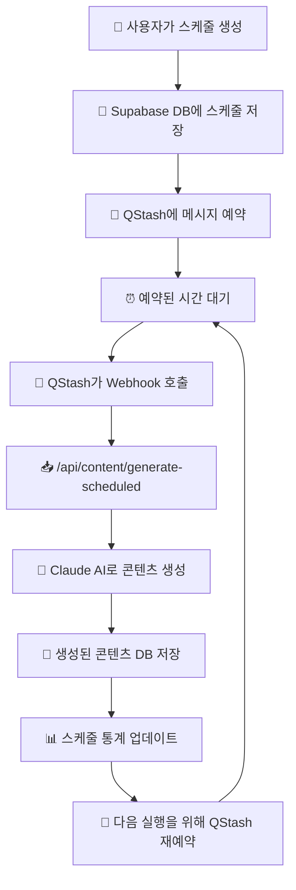

# 🚀 QStash 스케줄링 워크플로우

## 📋 **전체 워크플로우 흐름도**



## 🆚 **QStash vs 크론잡 비교**

### **QStash (현재 시스템)**
```
✅ 장점:
- 🌩️  서버리스: 서버가 꺼져있어도 실행
- 🛡️  안정성: Upstash가 메시지 전달 보장
- 📈  확장성: 자동 스케일링
- 💰  비용 효율: 실행할 때만 비용
- 🔄  재시도: 실패 시 자동 재시도
- 🕒  정확성: 정확한 시간에 실행

❌ 단점:
- 🌍  외부 의존성: Upstash 서비스 의존
- 💸  사용량에 따른 비용
- 🛜  네트워크 지연 가능성
```

### **크론잡 (전통적 방식)**
```
✅ 장점:
- 🏠  자체 제어: 외부 서비스 의존성 없음
- 💰  고정 비용: 서버 운영비만
- ⚡  빠른 응답: 네트워크 지연 없음

❌ 단점:
- 🖥️  서버 의존: 항상 서버 가동 필요
- ⚡  리소스 낭비: 매번 DB 스캔
- 🔧  복잡성: 중복 실행 방지 등 직접 구현
- 📈  확장성 제한: 서버 사양에 의존
```

## 📊 **현재 프로젝트 구현 세부사항**

### **1. 스케줄 생성 과정**
```typescript
// 1. 사용자가 프롬프트 생성 시
await createSchedule({
  name: "마케팅 콘텐츠 자동 생성",
  content_type: "x_post",
  frequency: "3hours",  // 3시간마다!
  time_of_day: "09:00",
  settings: {
    promptType: "custom",
    customPrompt: "사용자 커스텀 프롬프트..."
  }
})

// 2. QStash에 메시지 등록
const nextRun = calculateNextRun("3hours", "09:00", "Asia/Seoul")
const messageId = await scheduleContentGeneration(scheduleId, nextRun)
```

### **2. QStash 실행 과정**
```typescript
// QStash가 예약된 시간에 호출
POST /api/content/generate-scheduled
{
  "scheduleId": "uuid-here",
  "timestamp": "2024-01-15T09:00:00Z"
}

// 시스템 처리:
1. 스케줄 정보 DB에서 조회
2. 프롬프트 타입 확인 (auto/custom)
3. Claude AI로 콘텐츠 생성
4. contents 테이블에 저장
5. 스케줄 통계 업데이트 (total_generated++)
6. 다음 실행을 위해 QStash 재예약
```

### **3. 새로운 시간 간격 옵션**
```typescript
// 지원하는 빈도 옵션
export const FREQUENCY_LABELS = {
  'hourly': '매시간',
  '3hours': '3시간마다',    // 새로 추가!
  '6hours': '6시간마다',    // 새로 추가!
  'daily': '매일',
  'weekly': '주간',
  'monthly': '월간'
}

// 계산 로직
export function calculateNextRun(frequency, timeOfDay, timezone, fromDate) {
  if (frequency === '3hours') {
    // 현재 시간에서 3시간 후
    return new Date(fromDate.getTime() + (3 * 60 * 60 * 1000))
  }
  // ... 기타 로직
}
```

## 🧪 **테스트 기능**

### **즉시 실행 버튼**
- 스케줄 페이지에서 "지금 실행하기" 버튼 클릭
- `/api/schedule/run` 엔드포인트 호출
- QStash 없이 바로 콘텐츠 생성 테스트 가능

### **생성 이력 추적**
- `total_generated`: 총 생성 횟수
- `last_run_at`: 마지막 실행 시간
- `next_run_at`: 다음 실행 예정 시간

## 💡 **실제 동작 예시**

```
🕘 오전 9시: "3시간마다" 스케줄 생성
📡 QStash에 12시 실행 예약

🕛 정오 12시: QStash가 Webhook 호출
🤖 AI 콘텐츠 생성 → DB 저장
📡 QStash에 오후 3시 실행 예약

🕒 오후 3시: QStash가 Webhook 호출
🤖 AI 콘텐츠 생성 → DB 저장
📡 QStash에 오후 6시 실행 예약

... 무한 반복 ...
```

## 🔧 **QStash 설정 확인**

현재 환경변수:
- `QSTASH_TOKEN`: Vercel Marketplace에서 발급받은 토큰
- `QSTASH_CURRENT_SIGNING_KEY`: Webhook 서명 검증용
- `NEXT_PUBLIC_URL`: 콜백 URL (배포된 도메인)

## 🚀 **다음 단계**

1. ✅ 3시간 간격 스케줄링 구현 완료
2. ✅ 즉시 실행 테스트 기능 완료  
3. ✅ 생성 이력 추적 완료
4. 🔄 실제 3시간 간격 스케줄 테스트
5. 📊 상세한 실행 로그 및 모니터링 추가